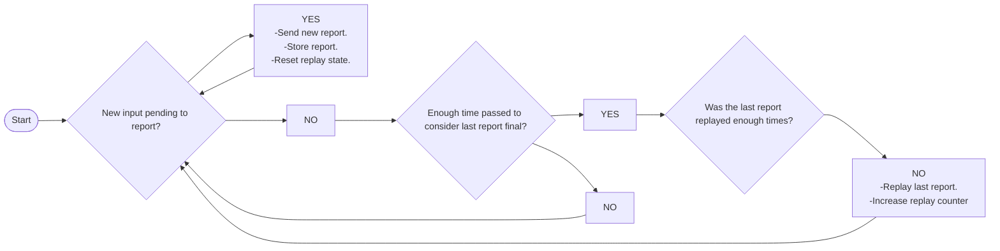

# Replay report logic

The replay feature was introduced as a simple mechanism to prevent stuck inputs if the last wireless report is lost (since the protocol does not have packet-received confirmation nor any resend logic yet).

It works by re-sending (replaying) the last report of an specific report type several times, and therefore reducing the chances that all these packets are lost.

